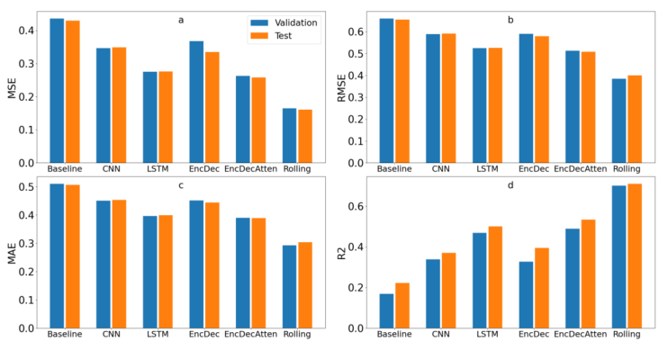

# Predicting drought using explainable machine learning based on satellite observations
## Objective
The aim of this project is to make predictions on agricultural drought factor - Soil Wetness Index (SWI) - in Germany using the Drought and Vegetation Data Cube (DVDC) provided by the European Organization for the Exploitation of Meterological Satellites (EUMETSAT). The prediction was based on different Recurrent Neural Networks (RNNs): an Encoder-Decoder which comprises of two parts: an encoder which analyses the historical data values and a decoder which makes predictions based on the information retrieved from the encoder; or a bidirectional LSTM allowing the information flowing in two directions: forward and backward so that a model can learn a relationship between a time step and its past and future values. It took the information of the past 12 months and made predictions in 12 months ahead. Consequently, a comparison between different prediction models was conducted to assess the performance of the proposed architecture in this project with other RNNs. 
## Drought and Vegetation Data Cube (DVDC)
The **Drought and Vegetation Data Cube (DVDC)** is a collection of data records of the portfolio of EUMETSAT Satellite Application Facilities (SAFs) and others relevant for drought and vegetation monitoring and analysis. The DVDC contains variables from different sources:
- Three of SAFs products: Climate Monitoring SAF (CM SAF), Support to Operational Hydrology and Water Management (H SAF), and Land Surface Analysis SAF (LSA SAF).
- The Global Precipitation Climatology Centre (GPCC), hosted at Deutscher Wetterdienst (DWD).
- ERA-5 re-analysis provided by the European Centre of Medium Ranger Weather Forecasting (ECMWF).

Features of DVDC:

## Methodology

## Models
The proposed model - Rolling LSTM:

The typical Encoder-Decoder model:

The Encoder-Decoder with Bahdanau attention mechanism model:

The bidirectional deep RNN model with LSTM cells:

The CNN (right) and baseline (left) model:

## Results
The metrics: Mean Squared Error (MSE), Root Mean Squared Error (RMSE), Mean Absolute Error (MAE), and the coefficient of determination R2. The lower the better: MSE, RMSE, MAE. The higher the better: R2.

The prediction result on the test data in each future step, from t = 1 month to t = 12 months:

Red indicates the highest value, while blue indicates the lowest value in each time step t.

The overall performance through all time steps:

The proposed method is the best, while the baseline is the worst.

The overview validation and test result of 6 models:

The prediction into 12 feature months by Rolling LSTM:

The uncertainty of the corresponding prediction:

